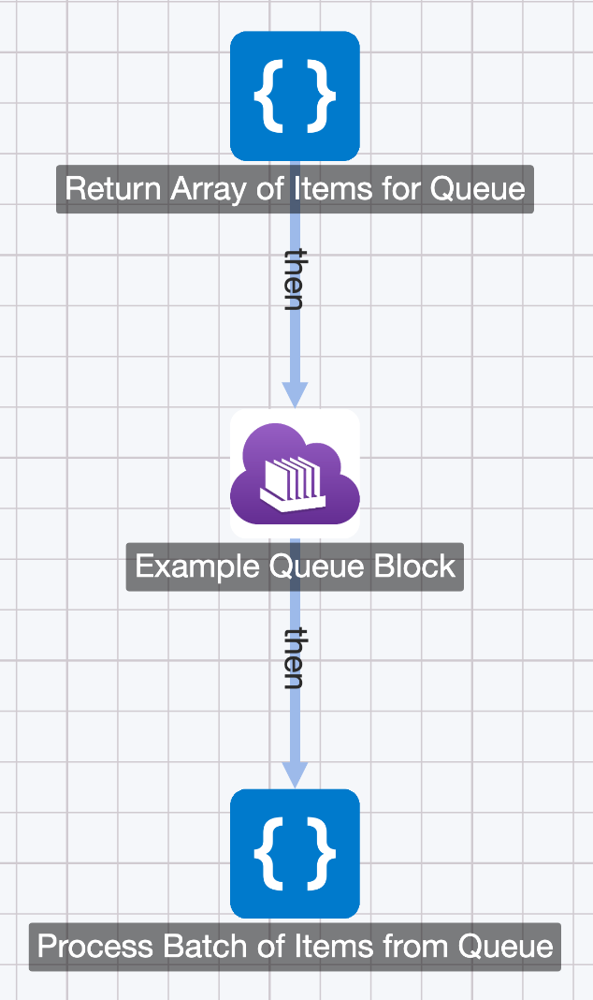

# The Refinery Blocks

Refinery supports a number of different node types, this documentation offers an easy reference for each one.

## The Block Types

* [Code Block](#code-block)
* [Timer Block](#timer-block)
* [Topic Block](#topic-block)
* [Queue Block](#queue-block)
* [API Endpoint Block](#api-endpoint-block)
* [API Response Block](#api-response-block)

## Code Block

A `Code Block` is a block which will run some code when it is run or transitioned to. Currently `Code Blocks` support the following languages:

* Node 8.10
* Node 10.16
* Python 3.6
* Python 2.7
* PHP 7.3
* Go 1.12
* Ruby 2.6.4

Generally speaking, `Code Blocks` make up the "meat" of a Refinery project. They contain all of the logic of your service and provide functionality that can be exposed by connecting other blocks to them.

### Input & Output

`Code Blocks` can be connected to one another in order to make more complex services. A given `Code Block` can return some data at the end of the script which will be passed as Block Input Data to any block connected to it.

For example, say we have two blocks: `Code Block A` and `Code Block B`. Say that `Code Block A` has the following code:

```python
# Code Block A
def main( block_input, backpack ):
    print( "Let's return some data!" )
    return [1,2,3,4,5]
```

And `Code Block B` has the following code:
```javascript
// Code Block B
async function main( block_input, backpack ) {
	console.log("Let's print out our input:");
	console.log(block_input);
	return false;
}
```

The output of the script in `Code Block B` will print the following:

```
Let's print out our input:
[ 1, 2, 3, 4, 5 ]
```

This is because the data returned from `Code Block A` is passed to `Code Block B` as input. By connecting `Code Blocks` together like this you can build highly-scalable microservices. You can imagine your data as water flowing through a pipe, it will come out of one block and go into another.


!!! info
	Note that multiple blocks will only execute in a chain fashion once deployed. In the editor view `Code Block` executions are standalone and do not trigger other blocks.

You also may have noticed that `Code Block A` and `Code Block B` are written in completely different languages. With Refinery you can build services utilizing multiple programming languages passing data to each other via transitions. The only limitation is that the returned data must be JSON-serializable (e.g. not a complex object). This covers all of the basic cases like strings, integers, arrays, etc.

### Block Options

* `Block Name`: The name of the `Code Block`.
* `Block Code`: This is the core code which will execute upon the `Code Block` being invoked. This must include the declaration of the function `main` which accepts two arguments `block_input` and `backpack`. `block_input` is the JSON-serializable input the `Code Block` was called with, and `backpack` is an object you can store data in which will be passed to future block executions automatically.

<video style="width: 100%" playsinlines controls autoplay muted loop>
	<source src="/blocks/images/running-code-block-fullscreen.webm" type="video/webm" />
	<source src="/blocks/images/running-code-block-fullscreen.mp4" type="video/mp4" />
</video>

You can also use the full screen editor to test and iterate on your scripts. The full screen editor allows for specifying custom Block Input Data to your script as well. This is useful for replaying issues you've encountered in your deployed service. By taking the Block Input Data from the logs and replaying it in the editor you can quickly reproduce problems and fix them accordingly.

* `Block Imported Libraries`: The libraries that should be pulled in for your `Code Block` script. Each language has support for it's own package-manager.
	* `Python 2.7`: [`pip` packages.](https://pypi.org/)
	* `Python 3.6`: [`pip` packages.](https://pypi.org/)
	* `Node 8.10`: [`npm` modules.](https://www.npmjs.com/)
	* `Node 10.16`: [`npm` modules.](https://www.npmjs.com/)
	* `PHP 7.3`: [`composer` packages.](https://packagist.org/)
	* `Go 1.12`: This option is disabled in Go, but you can install packages by simply importing them in your Go script.
	* `Ruby 2.6.4`: [`gem` packages.](https://rubygems.org/)

<video style="width: 100%" playsinlines controls autoplay muted loop>
	<source src="/blocks/images/adding-library-code-block.webm" type="video/webm" />
	<source src="/blocks/images/adding-library-code-block.mp4" type="video/mp4" />
</video>
	
* `Block Runtime`: The programming language for the `Code Block`. `Node 8.10`, `Python 2.7`, `PHP 7.3` and `Go 1.12` are currently the languages supported.
* `Execution Memory`: This is the allocated memory for the `Code Block` to run with. The CPU power of the `Code Block` is scaled proportional to the amount of memory allocated. If your script is taking too long to execute consider upping this.
* `Max Execution Time`: This refers to the max amount of time a `Code Block` is allowed to execute for. Setting this to a low value allows prevention of "zombie" or "runaway" `Code Block` from costing too much money with execution. The maximum time a block can execute for is 15 minutes.

### Warm & Cold Executions

The `Code Block` has one particularly interesting property that is not immediately apparent. If you execute a `Code Block` for the first time it will take a bit longer than when you execute it the second time. You will notice, especially in long chains of `Code Blocks`, that your execution time decreases significantly when the blocks have executed recently. This is because `Code Blocks` will remain "warm" after execution. The underlying AWS infrastructure will actually leave your `Code Block` scripts loaded in memory for some amount of time after an execution. By doing so, if another execution occurs shortly after, the execution can be completed much more quickly because the `Code Block` does not need to again be loaded into memory.

For more advanced reading on this topic, see [`AWS Lambda Execution Context`](https://docs.aws.amazon.com/lambda/latest/dg/running-lambda-code.html) (`Code Blocks` are AWS Lambda under the hood).

## Timer Block

Executes the `Code Blocks` which are linked to the `Timer Block` at a set interval. This can be something like every two minutes (`rate(2 minutes)`), every day at 5:00 PM, etc. Useful for operations which need to occur on a regular schedule in an a highly-reliable manner (e.g. an uptime checker).

### Settings
* `Block Name`: The name of the `Timer Block`
* `Schedule Expression`: An expression which defines how often the trigger should fire the connected `Code Blocks`. This follows the [AWS CloudWatch expression formats which are described here.](https://docs.aws.amazon.com/AmazonCloudWatch/latest/events/ScheduledEvents.html) Valid values include `rate(1 minute)` and `cron(*/2 * * * ? *)`.
* `Block Input Data`: JSON-serializable data which can be optionally passed as input to the connected `Code Blocks` when the `Timer Block` fires.

## Topic Block

Execute `Code Blocks` which are linked to it with the contents of the published topic. `Topic Blocks` are useful for situations where you want to execute multiple `Code Blocks` at the same time with the same input. This is often referred to as a ["pub-sub" pattern](https://en.wikipedia.org/wiki/Publish%E2%80%93subscribe_pattern). In contrast to the `Queue Block`, for example, an `Topic Block` has no concept of retries, queueing or polling.

As an example, if you passed some Block Input Data of `[1,2,3,4,5]` to a `Topic Block` and the block was connected to three `Code Blocks`, every connected `Code Block` would be executed in parallel with the input of `[1,2,3,4,5]`.

### Settings
* `Name`: The name of the `Topic Block`

## Queue Block

The `Queue Block` makes it easy to process a large number of things without writing any complex threading or concurrency-related code. With Refinery, our platform handles all of the complexity of auto-scaling and concurrency for you.

A `Queue Block` is used with at least two other `Code Blocks`, usually in a diagram like the following:

### Example `Queue Block` Diagram

<center>

</center>

### Example `Code Block` to Add Item(s) to the Queue

The block upstream of the `Queue Block` returns an array of items to be added to the queue (`Return Array of Items for Queue` in this case). Unlike traditional cloud queueing systems you don't need to write any API or glue code. You can return an array of 10 items or 10 million items and our platform will handle all the heavy-lifting of doing distributed-inserts to get your items into the queue. The following code is an example of returning items for the `Queue Block`:

```python
# Example in Python, other languages work essentially the same way.
def main(block_input, backpack):
    return_list = []
    for i in range( 0, 100 ):
        return_list.append(i)
    return return_list
```

!!! note
	While our platform automatically does the distributed-inserting of items into the queue, you are still charged for the worker execution time taken to do so.

	In the background this works by spawning up a number of concurrent `Code Block` instances to do multi-threaded inserts into the queue. Our custom runtime is designed to do this as cost-efficiently as possible and generally averages ~400 item inserts per second per concurrent instance. Up to 20 concurrent instances will be invoked depending on the size of the returned array of items to be placed into the queue (if you return 10 things, it'll be 1 instance and if you return 1 million things it'll be 20 instances). These instances will continually perform inserts until all of the items have been inserted into the queue. For example, if you return 1000 items it will take ~3 seconds to insert all of them into the queue and you will be charged for that short `Code Block` execution time.

	Generally, if you're processing a large number of items off a queue this additional cost is negligible. We've noted it here for cost-sensitive projects. If you have further questions about this behavior, please reach out to us for more information.

### "Magic" Queue Autoscaling

Once you've placed items into the queue the `Code Block` which is transitioned to from the `Queue Block` will automatically start being invoked with items from the queue. A batch of items is handed as input to the downstream `Code Block` which is adjustable by modifying the `Batch Size` of the `Queue Block`. You can configure a batch size of at least 1 item up to at max 10 items.

Your downstream `Code Block` (`Process Batch of Items from Queue`) in this example) will automatically scale-up if the queue is not emptied by the initial set of invoked instances of your `Code Block`. Your `Code Block` will automatically increase by 60 more concurrent instances every minute that the queue is not emptied by the current set of worker instances. For example, if you place 50,000 items in the queue and it takes ~10 seconds to process an item off the queue (batch size of 1), a run of your deployment will look something like this:

* `[+0 minutes]` ~5 concurrent instances pull and process items off the queue.
* `[+1 minutes]` ~65 concurrent instances pull and process items off the queue.
* `[+2 minutes]` ~125 concurrent instances pull and process items off the queue.
* etc.

This will continue until the queue is emptied. Once the queue is emptied the concurrency will automatically scale down.

All of this auto-scaling happens without the need of any extra code or configuration.

!!! warning
	It is important to know that having multiple `Code Blocks` downstream of a single `Queue Block` will likely not work the way you expect. Since `Code Blocks` operate in a "polling" fashion, the messages will not be split up or duplicated across multiple `Code Blocks` connected to the queue. Instead messages will randomly flow into the connected `Code Blocks` in no structured way. For a simple way to invoke multiple `Code Blocks` with the same input, see the `Topic Block` section. The basic rule of thumb is you can have as many `Code Blocks` as you want transitioning to the `Queue Block`, but you can have only `Code Block` transitioning out of the `Queue Block`.

!!! warning
	While you can return millions of items in an array and have them inserted into the queue, you should return less than ~1GB of total data at a time (this is the raw text size of all of the items in the array). If you need to return more than 1GB of data at a time, please reach out to us and we can upgrade your "transition capacity".


For an example of using the `Queue Block` to easily scrape a million URLs, see our ["Scraping a Million URLs in a Lunch Break"](/tutorials/scraping-a-million-urls/) tutorial.

### Settings
* `Name`: The name of the `Queue Block`
* `Batch Size`: The number of messages to pass into the connect `Code Blocks` as JSON-serializable input. This can be up to 10 total messages at a time. This is useful when you want to "batch" your processing to save on computation costs or to speed up processing.

## API Endpoint Block

The `API Endpoint Block` represents a single RESTful HTTP endpoint. Upon hitting the generated HTTP endpoint the connected `Code Blocks` will be triggered with the parameters and other HTTP request metadata passed as input. `API Endpoints Block` are useful for situations such as building a REST API on top of serverless, creating pipelines triggered by [webhooks](https://sendgrid.com/blog/whats-webhook/), and more. It's important to note that at a minimum an `API Endpoint Block` must be connected to a `Code Block` and the `Code Block` (or some `Code Block` in the pipeline) must transition into an `API Response` block.

!!! warning
	As of this time, AWS has a [hard limit](https://docs.aws.amazon.com/apigateway/latest/developerguide/limits.html#api-gateway-execution-service-limits-table) of 29 seconds before timing out HTTP requests made to [API Gateways](https://docs.aws.amazon.com/apigateway/latest/developerguide/welcome.html) (which are what API Endpoints deploy as). This complicates using API Endpoints for RESTful APIs because of the likelyhood of the computation taking longer than 29 seconds to finish (resulting in the API Gateway timing out).
	
### Settings
* `Name`: The name of the API Endpoint
* `HTTP Method`: The HTTP method for the API Endpoint to accept. Note that there can be multiple endpoints with the same path but with different HTTP methods.
* `Path`: The HTTP path.

## API Response Block

`API Response Block` is a block which will return the data returned from a linked `Code Block` as an HTTP response. An `API Response Block` is used downstream in a chain of `Code Blocks` which started with an API Endpoint trigger. Note that due to the [hard AWS  limit](https://docs.aws.amazon.com/apigateway/latest/developerguide/limits.html#api-gateway-execution-service-limits-table) of 29 seconds before API Endpoints time out, the transition to an API Response must occur in this time frame. If the pipeline execution starts with an API Endpoint and the intermediary `Code Block` executions take longer than 29 seconds the request will time out.

If the data passed as input to the `API Response Block` does not contain the `body` key, then the data will be returned as a JSON blob in a HTTP response with the `Content-Type` set to `application/json`. For finer-grained control over the HTTP response, such as the ability to set headers, status codes, and more, return a JSON structure which complies with the proper format for [AWS HTTP responses](https://docs.aws.amazon.com/apigateway/latest/developerguide/set-up-lambda-proxy-integrations.html#api-gateway-simple-proxy-for-lambda-output-format).
