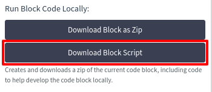
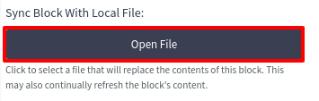
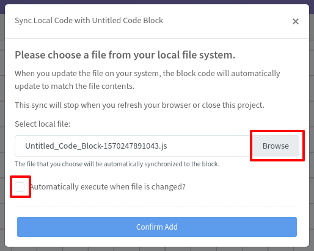
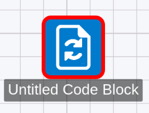

# Using Refinery With Your Favorite Editor (Local File Hot Reloading)

If you prefer using your own desktop editor to write code, Refinery supports using it to build services. The only catch is that this feature **only works with the Chrome web browser** due to a subtlety in the browser's handling of files. It requires no extra software and can be done just using your Chrome web browser.

## Setting Up Local File Hot-Reload

To use your local editor with Refinery, select a Code Block you want to work on and click the `Download Block Script` button under the `Run Block Code Locally` option group:

This will download the current Code Block file so you can open it in your preferred editor. We'll use `Sublime Text` as our example editor, but you can of course use any editor you prefer (as long as it's not [`emacs`](https://xkcd.com/378/)).

Once you've opened the file in your editor, you need to create a hot-reload link which will automatically update the `Code Block`'s contents upon a change being made to the local file. You can also enable automatic execution of the `Code Block` as well if you'd like to immediately run your code after saving it.

To link the `Code Block` to your local file, click the `Open File` button under the `Sync Block With Local File` option:

	

Once you've done so, you'll be presented with the following prompt:

	

Click the `Browse` button to select the previously-downloaded file from your local computer's file system. Optionally, you can also check the `Automatically execute when file is changed?` box to automatically execute the `Code Block` every time you save your file on your computer.

Once you've finished, click `Confirm Add`. Your `Code Block` will now be automatically updated with the contents of your local file every time you save it! You will also note that the `Code Block` icon is changed to the following:

	

This means that the `Code Block` is in sync with your local file. Note that you can have multiple `Code Blocks` in sync at the same time.