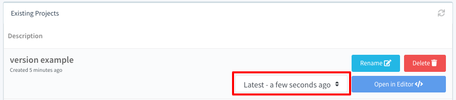
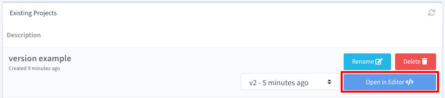

# Project Versioning & Reverting Changes

All projects in Refinery are automatically versioned every time a project save is performed. For example, if you create a project, add three blocks, and then click `Save Project` you will have created a new version of the project (the latest version). This is important to know, because you can easily revert a project to previously-saved versions on the [projects page](https://app.refinery.io/projects).

!!! note
	You should make a habit of clicking the `Save Project` button frequently to allow easy reverting to previous project states. If you ever accidentally lose your project progress due to not saving please reach out to us at `support@refinery.io` or [message us in our Slack channel](https://join.slack.com/t/refinerydevs/shared_invite/enQtNzkxNTgzNDU3MzQ0LTljNzA1NTMxYTQ2ZTdlNzc1MzU4MDkzNmU0Nzg0NDk3NzFmYjgzM2E5ZjA3MmQxZjBlZTI2MTFiNTAxNTIwNTQ). In some circumstances we may be able to help you recover the project data you lost.

## Reverting to a Previous Version of the Project

If you've made a mistake and wish to revert to a previous version of the project, navigate to the [`All Projects`](https://app.refinery.io/projects) page.

If you have previous version(s) of your project available you will see a drop-down next to the `Open in Editor` button for your project:

	

Using this drop-down you can select a previous project version. Once you've selected a previous version of your project, click the `Open in Editor` button to open this version in the Refinery editor:

	

You are now viewing the previous verison of the project. Note that opening the previous version does not implicitly make this version the latest version of the project. Once you've verified the version you've opened you can make it the current version of the project by modifying the project and clicking the `Save Project` button.