# Shared Files (Sharing Files Across Multiple Code Blocks)

Often times when building projects in Refinery you'll want to have a shared library across multiple `Code Blocks`. For example, if you have custom libraries you've written, ORM model declarations, config files, etc. Refinery makes it easy to share files across multiple `Code Blocks` with its Shared Files functionality.

Shared Files are unique in Refinery because they can live across multiple `Code Blocks`. When you create a Shared File you must link it to each `Code Block` that you want it to be added to. Once you've added a Shared File to multiple `Code Blocks` you can update the contents of a Shared File and it will be automatically updated across all the blocks it is linked to. All Shared Files which are added to `Code Blocks` are available under the `shared_files/` directory (this is in the same directory as your root `Code Block` script).

## View a Project's Shared Files

To see the list of Shared Files for your project, click the `Shared Files` button in the toolbar on the left-side of the editor:

	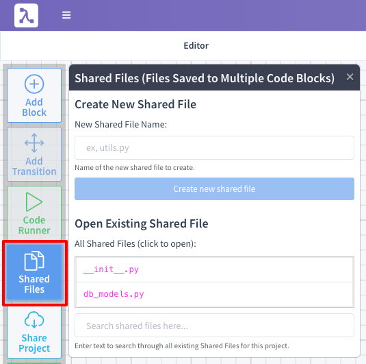

Clicking this button will open the Shared Files panel which displays all existing Shared Files. You can see in our example screenshot above we have two Shared Files for the project: `__init__.py` and `db_models.py`.

## Creating a New Shared File

To create a new Shared File, click the `Shared Files` button in the toolbar on the left-side of the editor:

	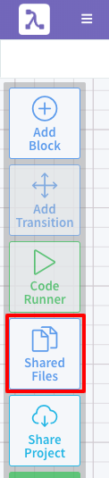

Once you've done so, enter your new Shared File's name under the `New Shared File Name` text box and click the `Create new shared file` button:

	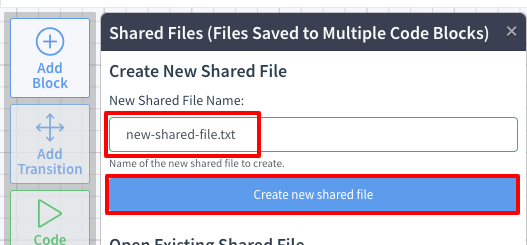

You'll then be presented with an editor for your newly-created Shared File. You can change the file's name and modify it's contents using this editor:

	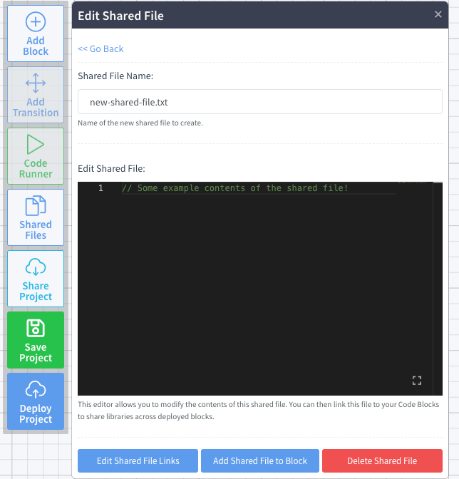

!!! info
	Please note that just creating a Shared File does not add it to any `Code Blocks`. See the [Adding Shared Files to Code Blocks](#adding-shared-files-to-code-blocks) section on how to add a Shared File to Code Blocks in your project.

## Adding Shared Files to Code Blocks

To add a Shared File to a `Code Block` click the `Shared Files` button in the toolbar on the left-side of the editor:

	

Click on the Shared File name that you want to add to your `Code Blocks`:

	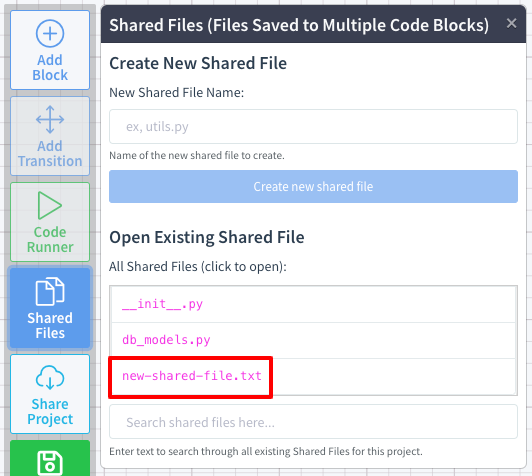

In this example, we'll select the `new-shared-file.txt` Shared File. Clicking on this file will open the Shared File editor and display the contents of the file.

Click the `Add Shared File to Block` button at the bottom of the panel:

	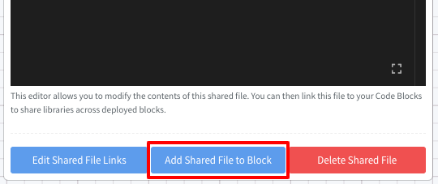

Once you've done so the `Code Blocks` in your project will begin to flash:

	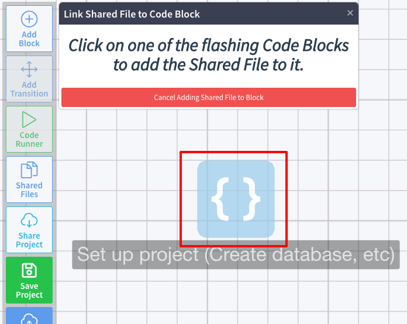

Click on the `Code Block` you want to add the Shared File to. Once you've done so the Shared File is now available in the Shared Block under the `./shared_files/` directory.

## View a Code Block's Shared Files

To view all Shared Files for a given `Code Block`, click the `View Block Shared Files` button under the `Shared Files` section of the `Code Block` edit pane:

	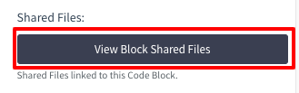

This opens up the `Code Block Shared File(s)` pane which shows a file tree of the `Code Block`'s files:

	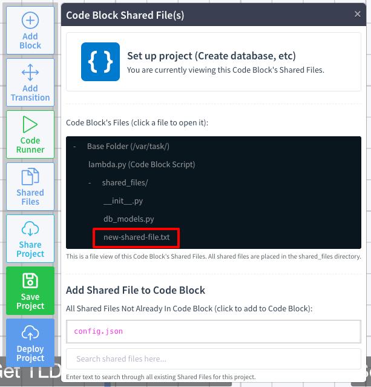

## Remove a Shared File from a Code Block

Click the `View Block Shared Files` button under the `Shared Files` section of the `Code Block` edit pane:

	

This opens up the `Code Block Shared File(s)` pane which shows a file tree of the `Code Block`'s files:

	

In this example, we'll select the `new-shared-file.txt` Shared File. Clicking on this file will open the Shared File editor and display the contents of the file.

Click on the Shared File you want to remove from your `Code Block`, for our example we'll click on `new-shared-file.txt`.

This opens up the Shared File editor for `new-shared-file.txt`, click on the `Edit Shared File Links` button at the bottom of the editor:

	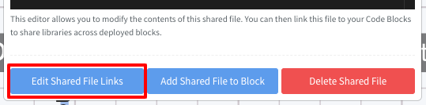

You can then see all of the `Code Blocks` the Shared File is linked to. Find the `Code Block` you wish to remove the Shared File from and click the `Unlink from Block` button:

	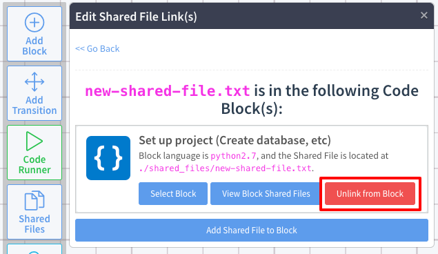

!!! info
	Note that this will **not** delete the Shared File but will simply un-link it from the `Code Block`.

## Delete a Shared File

To delete a Shared File click the `Shared Files` button in the toolbar on the left-side of the editor:

	

Click on the Shared File name that you want to delete:

	

In this example, we'll select the `new-shared-file.txt` Shared File. Clicking on this file will open the Shared File editor and display the contents of the file.

Click the `Delete Shared File` button to delete the Shared File from your project:

	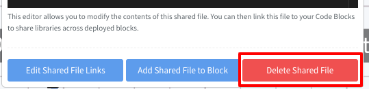

It goes without saying that this will also remove the Shared File from all of the `Code Blocks` that it was linked to.