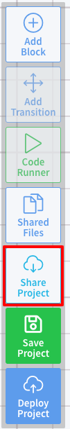
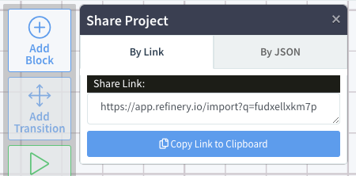
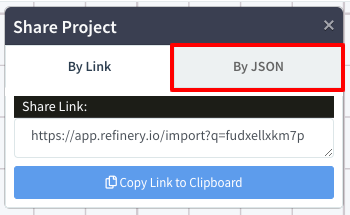
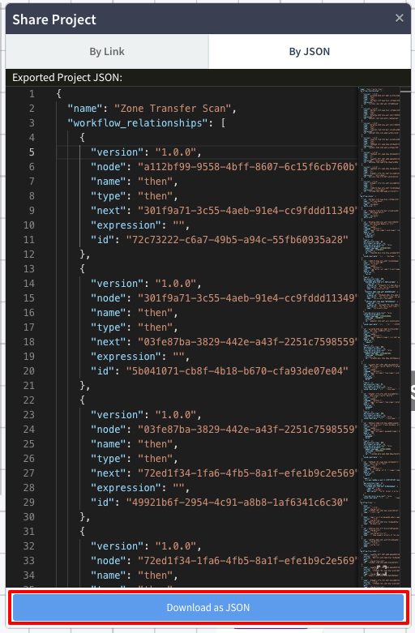

# Sharing/Forking Projects

In you can quickly and easily fork and share projects you've created with other developers. You can even share your project with people who don't have a Refinery account themselves.

!!! important
	When you share a Refinery project with someone, make sure you don't have any secrets or sensitive information in your project source code. Note that environment variable values are **not** shared when you share your project with someone (the names, descriptions, and required status are shared). This is to ensure that secrets and configuration values are not accidentally leaked. So if you have a project with an environment variable named `API_KEY` and you share it with someone they will not have access to the value of that variable. They will only see that the `API_KEY` environment variables exists and should be set to something.

## Sharing Your Project via a Share Project Link

To share your Refinery project with someone (even if they don't have an account), click the `Share Project` button in the toolbar on the left-side of the editor:

	

This will open a `Share Project` pane with a link you can use to share your project:

	

To copy the link to your clipboard, click the `Copy Link to Clipboard` button below the link.

The following is an example of the share project link that will be generated:
[https://app.refinery.io/import?q=td5zpsp5s7gw](https://app.refinery.io/import?q=td5zpsp5s7gw)

!!! note
	Sharing a project in Refinery shares a point-in-time copy of the project at the time the link is created. These links will not be updated with the latest version of the project and should be thought of as a "forking" action. To share an up-to-date copy of your project, simply click the `Share Project` button again to generate another link.

## Share Project via JSON

All Refinery projects can be exported and imported as JSON. This JSON is a fully-reproducible diagram to deploy the project. It contains all of the code, blocks, block settings, transitions, and other metadata for your project. The only thing that is not included in the project JSON is the value of environment variables.

To download the JSON diagram of your project, click the `By JSON` tab in the `Share Project` pane:

	

To download the JSON, click the `Download as JSON` button:

	

