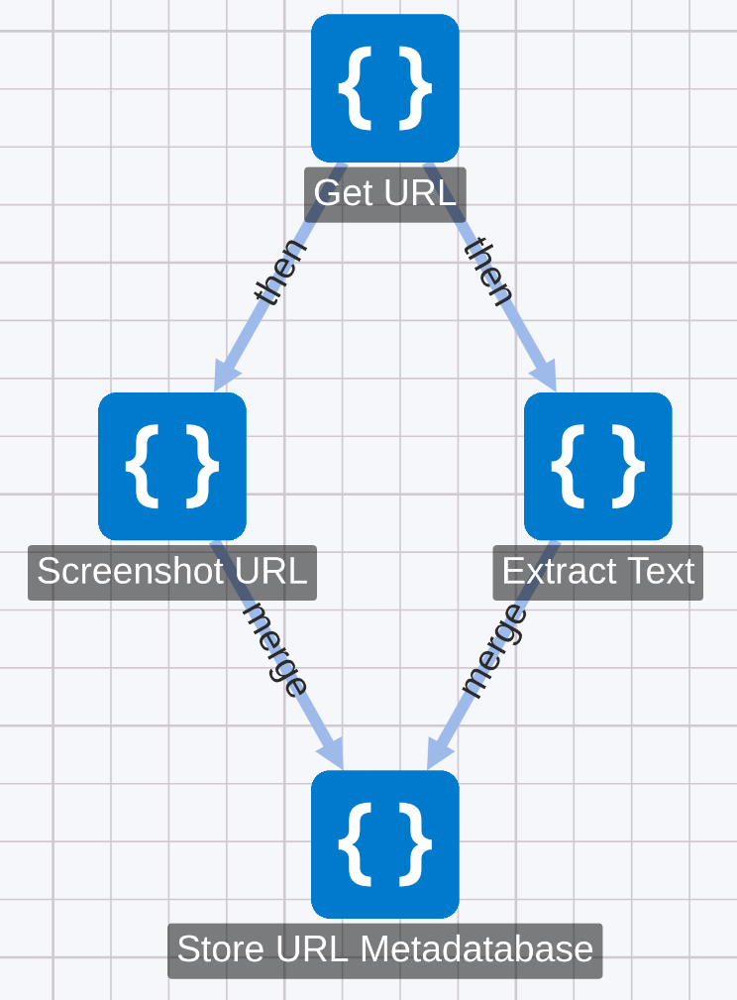
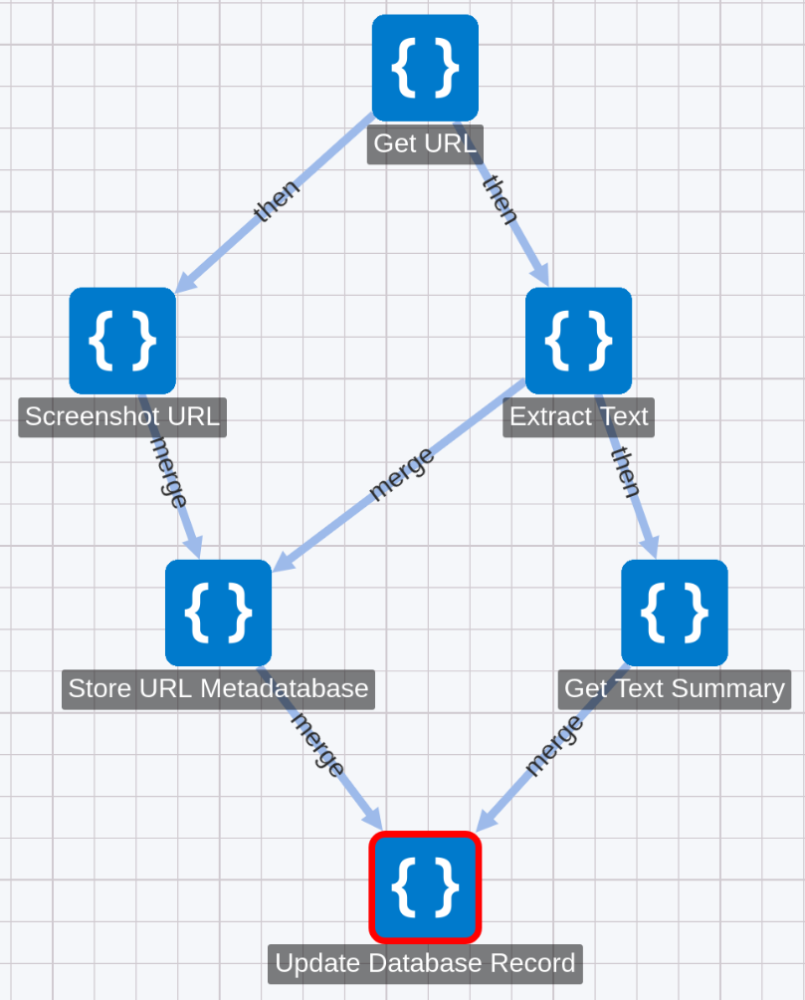

# Transitions

Transitions are a large part of what makes Refinery an extremely powerful platform. Transitions allow different block types to be connected in a variety of ways in order to build large services and pipelines.

## Transition Types
* [`then`](#then)
* [`if`](#if)
* [`else`](#else)
* [`exception`](#exception)
* [`fan-out`](#fan-out)
* [`fan-in`](#fan-in)
* [`merge`](#merge)

## `then`

`then` is the most simple of the transitions. It will simply always pass the return data from a block to another block as input. The only time that `then` will not occur is when an exception occurs (which can be caught using the [`exception`](#exception) transition).

## `if`

`if` is useful for situations where you only want to perform a transition if the return data from a `Code Block` matches a certain condition. For example, only transition if the returned `array` or `list` has a length greater than zero. This transition carries the unique property of having a `Conditional Expression`. These are expressions which are written in Python that will cause the transition to occur if the expression evaluates to a value of `True`.

## `else`

`else` is a conditional transition which will execute if no other conditions are valid. For example, if a `Code Block` has a `then` transition along with an `if` transition with a condition expression of `len(return_data) > 0` and the `return_data` has a length of `0`, the `then` transition would be followed.

## `exception`

The `exception` transition is followed when the base `Code Block` raises an exception which is uncaught. This can be useful for situations where alerting on exceptions is necessary, or situations where recovering from a specific exception is necessary.

The following is an example of the data which is returned in an `exception` transition:
```json
{
    "input_data": 0,
    "version": "1.0.0",
    "exception_text": "Traceback (most recent call last):\n  File \"/var/task/lambda.py\", line 1089, in _init\n    return_data = main( block_input, context )\n  File \"/var/task/lambda.py\", line 4, in main\n    return ( 100 / lambda_input )\nZeroDivisionError: integer division or modulo by zero\n"
}
```

You can use this information to react differently depending on the specific details of the exception.

!!! note
	An `exception` transition will result in the `Code Block` execution not being marked as failed in the debugging view.

## `fan-out`

The `fan-out` transition takes a return value of a list of items and invokes the connected block with each item in the list as a single input. For example, if a `Code Block` returned an array of `[1, 2, 3, 4, 5]` the next `Code Block` linked with the `fan-out` transition would be called five times with the inputs of `1`, `2`, `3`, `4`, and `5` respectively. This allows for performing quick and simple concurrent processing of data. It's important to note that you are spinning up a virtual server for each item in the returned array. This is useful for when you need many machines to perform some work (converting 100 images concurrently across many machines) but it's overkill when you're attempting to do simple operations which could be accomplished in a `for` loop, for example.

!!! warning
	`fan-out` transitions should only be used for less than 1,000 items. If you `fan-out` more than 1,000 items you may encounter invocation throttling which will slow down or potentially break your pipeline.

!!! warning
	The `fan-out` transition is a powerful construct. It allows for developers to easily perform a large number of `Code Block` invocations without much effort. If not used carefully it can result in an excessive usage of `Code Blocks`, causing a higher-than-expected AWS bill.

## `fan-in`

The `fan-in` transition is the sister-transition of the `fan-out` transition. Using `fan-in` you can take the output of all of the concurrently invoked `Code Blocks` and pass the return values as an array to a single `Code Block`. For example, if a `fan-out` transition executes three `Code Blocks` concurrently and they return `1`, `2`, and `3` the input to the `Code Block` connected by the `fan-in` transition will be `[2, 1, 3]`.

!!! warning
	If any uncaught exceptions occur during a `fan-out` chain the `fan-in` transition will fail to execute. It's important to ensure that all exceptions are caught to prevent breaking a down-stream `fan-in` transition.

!!! note
	The order of the returned values in the array is non-deterministic.

!!! note
	You can also have multiple nodes chained together before ending in a `fan-in` transition (instead of just a `fan-out` to a `Code Block` node to a `fan-in`). However, if all of the `Code Blocks` do not `fan-in` properly the transition will fail. This can occur in situations such as a `Code Block` reaching its max execution time, for example.

## `merge`

The `merge` translation allows you to merge multiple execution pipelines back together after branching with multiple transitions. The following is an example of a simple `merge` transition:



The start of the Refinery pipeline starts with a `Code Block` transitioning to two blocks via a `then` transition. The final `Code Block` titled `Store URL Metadatabase` will be run after the `Screenshot URL` and `Extract Text` Code Block finish executing. The input to the final `Code Block` is an array of the return values of both previous blocks.

`merge` transitions additionally allow for multiple nested levels of merging. The following image is an example of this:



In this example we can see we do a merge twice, once after the `Screenshot URL` and `Extract Text` `Code Blocks`, and once again after the `Store URL Metadatabase` and the `Get Text Summary` `Code Blocks` complete. This can be done as many times as desired, although it's important to note that a `merge` transition will only work if the number of `merge` transitions match the number of branched transitions. So if you have two `then` transitions from a `Code Block`, you'll have to have two `merge` transitions.

!!! note
	The order of the returned values in the input array from a merge is non-deterministic.